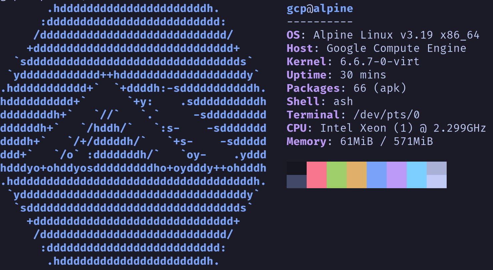

# Alpine GCP Image Builder
This Packer template can be used to create an Alpine Linux image that is compatible with GCP, QEMU and Xen.

## Purpose
Although Alpine Linux is most commonly used as a base system for container images, it is also possible to use Alpine as a full operating system on bare metal or a hypervisor. 

The minimal nature of this distribution is an advantage when using low-power, shared core machine types such as `f1-micro`, `g1-small` or `e2-micro` due to the significantly lower idle CPU and memory requirements of Alpine. The ability to create images >=1GB can also result in a minor cost saving in use cases where only a small amount of storage is required.

## Usage
### Building an image
- Create the image using Packer:
`packer build alpine-gcp.json`
- Compress the image:
`tar --format=oldgnu -Sczf /tmp/alpine_gcp.tar.gz build/disk.raw`

### Deployment
If you already have a Cloud Storage bucket that you would prefer to use, replace the path `gs://alpine-gcp` in the commands below with the path to your own bucket.

- Create a Cloud Storage bucket:
`gsutil mb gs://alpine-gcp`
- Upload the compressed image to the bucket:
`gsutil cp /tmp/alpine_gcp.tar.gz gs://alpine-gcp`
- Import the image as a new custom image:
`gcloud compute images create alpine-gcp --source-uri gs://alpine-gcp/alpine_gcp.tar.gz`

You will now be able to create an instance using the image:
`gcloud compute instances create instance-name --zone zone --image alpine-gcp`

It is important to bear in mind that storing files in Cloud Storage will incur costs regardless of whether the image is in use by Compute Engine. To avoid this, consider periodically deleting unused/deprecated images from your Cloud Storage bucket.

## Configuration files
The `./files/config` directory contains a number of files which are copied to the generated image:

|Repo File                      |Location on image FS            |Purpose                                   |
|-------------------------------|--------------------------------|------------------------------------------|
|./files/config/grub            |/etc/defaults/grub              |Modified GRUB configuration for GCP       |
|./files/config/inittab         |/etc/inittab                    |Enables serial port for GCP console       |
|./files/config/sshd_config     |/etc/ssh/sshd_config            |Disables password login                   |
|./files/config/authorized_keys |/home/user/.ssh/authorized_keys |Default SSH public keys for `user` account|

## Limitations
- GCP do not support installation of the guest environment on Alpine Linux images. This means that some features will be unavailable on machines created using this template. Some of these absent features are listed below:
    - SSH authentication via OS Login
    - SSH authentication via metadata
    - Setting hostname of instance
    - Disk expansion through `gce-disk-expand`

- Some of these limitations can be mitigated by creating custom scripts that query the metadata service and carry out relevant tasks (such as adding SSH keys to accounts or altering the hostname of the VM).
- This template is configured to create an image with the name `disk.raw`. This can be changed to an alternative name but the GCP import step will fail if this is done.
- This template is capable of creating images that are around ~350MB in size if swap is disabled. If you intend to upload these images to GCP, the image size must be set to 1GB or greater.

## Other Tools
Depending on your use case, this template may not be suitable for your needs. If you do not need the modifications required to run Alpine on GCP, it might be worth checking out some of these similar projects:
- [__Make Alpine Linux VM Image__](https://github.com/alpinelinux/alpine-make-vm-image): This project is provided by the Alpine Linux team and is useful for creating general purpose VM images in a variety of formats. In most cases, this is what you probably want.
- [__packer-alpine__](https://github.com/bobfraser1/packer-alpine): This Packer template from @bobfraser1 creates images compatible with Virtualbox/Vagrant.
- [__alpine-openstack-image__](https://github.com/rvalente/alpine-openstack-image): This Packer template from @rvalente creates images compatible with the Openstack platform.

## Credits
This template is based upon the steps detailed by __Mitchell Riedstra__ [within this blog post](https://riedstra.dev/2019/09/alpine-gcp).

It is also based upon [the Vagrant/Packer template](https://github.com/bobfraser1/packer-alpine) created by __@bobfraser1__.

## License

Alpine GCP Image Builder is released under the MIT license. See LICENSE for details.

